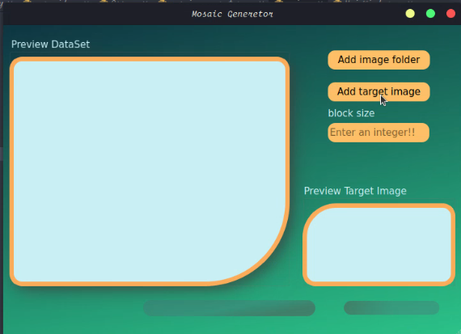
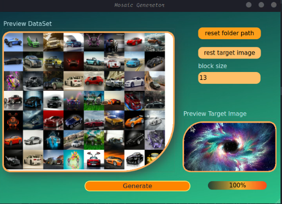
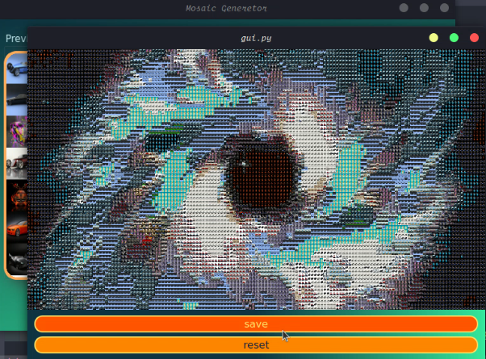

# Mosaic_generator python application
This is an mosaic generator python application/GUI application that generates mosaic photoos with python and OpenCv and further on the GUI it uses PyQt6

# GUI
## How to use
Run this command on terminal to execute GUI:
```sh
python3 gui.py
```
## Example output

  |  |  
:-------------------------:|:-------------------------:|:-------------------------:
  		
# Raw generator
## Requirements
target photo

dataset photos

## How to use
Run this command on terminal to execute raw generator:
```sh
python mosaic.py $block_size $target_image $dataset_path
```
## Example
```sh
python3 mosaic_generator.py 33 assets/wci.jpg assets/cars
```

  |  
:-------------------------:|:-------------------------:

Original image (assets/wci.jpg)             |  Mosaic output (assets/3_sample_wci_output.png)
